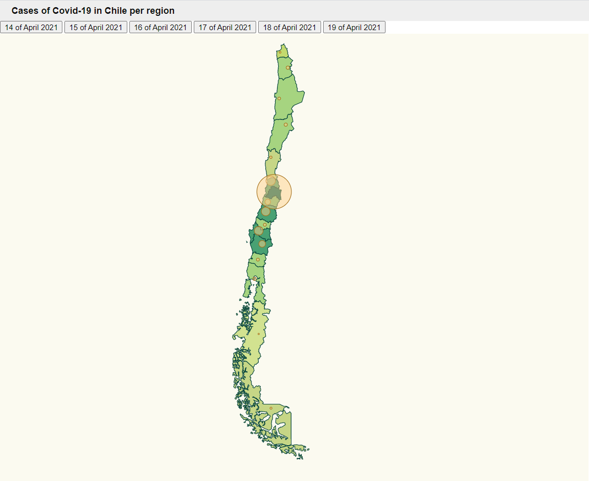

# Multiple Series with Background Scale in Chile

In this challenge we want to obtain something like this:




# Steps

- We will take as starting example the second task _Data_Visualization_Task2_, let's copy the content from that folder and execute _npm install_.

```bash
npm install
```
- In this case I have been collecting daily the infections collected per region in Chile.
- First of all it is necessary to upload the json with the regions of Chile (https://github.com/deldersveld/topojson/tree/master/countries/chile):
_./src/chile-regions.json_

- Chile is divided in 16 regions with coordinates:

_./src/regions.ts_

```diff
export const latLongRegions = [
  {
    name: "Región de Tarapacá",
    long: -68.99915,
    lat: -20.2167,
  },
  {
    name: "Región de Antofagasta",
    long: -70.03954,
    lat: -23.65236,
  },
  {
    name: "Región de Atacama",
    long: -69.2500000,
    lat: -26.5000000,
  },
  {
    name: "Región de Coquimbo",
    long: -71.03947,
    lat: -29.95332,
  },
  {
    name: "Región de Valparaíso",
    long: -71.062963,
    lat: -32.36,
  },
  {
    name: "Región del Libertador Bernardo O'Higgins",
    long: -71.4105900,
    lat: -34.4862300,
  },
  {
    name: "Región del Maule",
    long: -71.65542,
    lat: -35.4264,
  },
  {
    name: "Región del Bío-Bío",
    long: -72.5000000,
    lat: -37.3000000,
  },
  {
    name: "Región de La Araucanía",
    long: -72.08333,
    lat: -38.5389,
  },
  {
    name: "Región de Los Lagos",
    long: -73.0000000,
    lat: -41.7500000,
  },
  {
    name: "Región de Aysén del Gral.Ibañez del Campo",
    long: -72.5000000,
    lat: -46.5000000,
  },
  {
    name: "Región de Magallanes y Antártica Chilena",
    long: -71.022779,
    lat: -52.295847,
  },
  {
    name: "Región Metropolitana de Santiago",
    long: -70.6472400,
    lat: -33.4726900,
  },
  {
    name: "Región de Los Ríos",
    long: -72.59789,
    lat: -40.0027,
  },
  {
    name: "Región de Arica y Parinacota",
    long: -69.929792,
    lat: -18.4746,
  },
  {
    name: "Región de Ñuble",
    long: -71.7622,
    lat: -36.7226,
  },
];
```

- The infections cases have been collected in _./src/stats.ts_, the first day was on 14th of April 2021:
_./src/stats.ts_
```diff
// 14 de abril 2021
export const stats1:  ResultEntry[] = [
  {
    name: "Región de Tarapacá",
    value: 147,
  },
  {
    name: "Región de Antofagasta",
    value: 112,
  },
  {
    name: "Región de Atacama",
    value: 144,
  },
  {
    name: "Región de Coquimbo",
    value: 86,
  },
  {
    name: "Región de Valparaíso",
    value: 552,
  },
  {
    name: "Región del Libertador Bernardo O'Higgins",
    value: 293,
  },
  {
    name: "Región del Maule",
    value: 515,
  },
  {
    name: "Región del Bío-Bío",
    value: 516,
  },
  {
    name: "Región de La Araucanía",
    value: 376,
  },
  {
    name: "Región de Los Lagos",
    value: 149,
  },
  {
    name: "Región de Aysén del Gral.Ibañez del Campo",
    value: 13,
  },
  {
    name: "Región de Magallanes y Antártica Chilena",
    value: 61,
  },
  {
    name: "Región Metropolitana de Santiago",
    value: 2242,
  },
  {
    name: "Región de Los Ríos",
    value: 122,
  },
  {
    name: "Región de Arica y Parinacota",
    value: 42,
  },
  {
    name: "Región de Ñuble",
    value: 122,
  },
];
```
- All the infection numbers have been taken from https://www.minsal.cl/nuevo-coronavirus-2019-ncov/casos-confirmados-en-chile-covid-19/.

- Now we have to implement a chart that colors each community of Chile depending on how heavy they have been affected by Coronavirus.
- If we check the values they start from 0 to 3000 approx, let's assign a range of colors for that domain:

_./src/index.ts_

```diff
// set the affected color scale
const color = d3
  .scaleThreshold<number, string>()
  .domain([0, 10, 20, 50, 100, 200, 300, 600, 3000])
  .range([
    "#FFFFF",
    "#e1ecb4",
    "#d2e290",
    "#c3da6e",
    "#c6d686",
    "#A6D480",
    "#77BB79",
    "#49A173",
    "#006358",
  ]);
```

- We'll use the same help function to map from community to color.

_./src/index.ts_

```diff
const assignCommunityBackgroundColor = (comunidad: string,
                                      stats: ResultEntry[]) => {
  const item = stats.find(
    (item) => item.name === comunidad
  );
  return item ? color(item.value) : color(0);
};
```

- In this occasion, as all data is collected in the same month the infections are similar from one day to other, it won't be necessary to normalize the data.

_./src/index.ts_

```diff
const maxAffected = stats1.reduce(
  (max, item) => (item.value > max ? item.value : max),
  0
);

const affectedRadiusScale = d3
  .scaleLinear()
  .domain([0, <any>maxAffected])
  .range([0, 30]); // 30 pixel max radius, we could calculate it relative to width and height

const calculateRadiusBasedOnAffectedCases = (
  comunidad: string,
  dataset: ResultEntry[]
) => {
  const entry = dataset.find((item) => item.name === comunidad);

  // It is necessary to scale the numbers because they differ a lot from the previous and the actuals
  return entry ? ((affectedRadiusScale(entry.value)+1)) : 0;
};
```

- Another important thing is to center the map:

_./src/index.ts_

```diff
const aProjection = d3
  .geoMercator()
  // Let's make the map bigger to fit in our resolution
  .scale(830)
  // Let's center the map
  .translate([1500, -240]);

```

- We have also added a marker for the circles in the upadteChart:
- 
_./src/index.ts_

```diff
const updateChart = (stat: ResultEntry[]) => {
  console.log("updating")
  svg.selectAll("path").remove();
  svg.selectAll("circle").remove();
  svg.selectAll("path")
  .data(geojson["features"])
  .enter()
  .append("path")
  .attr("class", "country")
  // data loaded from json file
  .attr("d", geoPath as any)
  .style("fill", function (d: any) {
    return assignCountryBackgroundColor(d.properties.Region, stat);
  });
  svg
    .selectAll("circle")
    .data(latLongRegions)
    .enter()
    .append("circle")
    .attr("class", "affected-marker")
    .attr("r", (d) => calculateRadiusBasedOnAffectedCases(d.name, stat))
    .attr("cx", (d) => aProjection([d.long, d.lat])[0])
    .attr("cy", (d) => aProjection([d.long, d.lat])[1])
    .attr("d", geoPath as any)
    .on("mouseover", function (d, i) {
      d3.select(this).attr("class", "selected-marker");
    })
    .on("mouseout", function (d, i) {
      d3.select(this).attr("class", "affected-marker");
    });
};
```

- It was also necessary adding the selected-marker style:

_./src/map.css_

```diff
.selected-marker {
  stroke-width: 1;
  stroke: #bc5b40;
  fill: #f88f70;
  fill-opacity: 0.7;
}
```

- As we said before, we have collected the incidents of Covid-19 during the last days (12-19 of April) so it is necessary adding the buttons:

_./src/index.ts_

```diff
// Buttons and changing data series
document
  .getElementById("14 April 2021")
  .addEventListener("click", function handleResults() {
    updateChart(stats1);
  });

document
  .getElementById("15 April 2021")
  .addEventListener("click", function handleResults() {
    updateChart(stats2);
  });

document
.getElementById("16 April 2021")
.addEventListener("click", function handleResults() {
  updateChart(stats3);
});

document
.getElementById("17 April 2021")
.addEventListener("click", function handleResults() {
  updateChart(stats4);
});

document
.getElementById("18 April 2021")
.addEventListener("click", function handleResults() {
  updateChart(stats5);
});

document
.getElementById("19 April 2021")
.addEventListener("click", function handleResults() {
  updateChart(stats6);
});
```

_./src/index.html_

```diff
<html>
  <head>
    <link rel="stylesheet" type="text/css" href="./base.css" />
    <link rel="stylesheet" type="text/css" href="./map.css" />
  </head>
  <body>
    <h2>Cases of Covid-19 in Chile per region</h2>
    <div>
      <button id="14 April 2021">14 of April 2021</button>
      <button id="15 April 2021">15 of April 2021</button>
      <button id="16 April 2021">16 of April 2021</button>
      <button id="17 April 2021">17 of April 2021</button>
      <button id="18 April 2021">18 of April 2021</button>
      <button id="19 April 2021">19 of April 2021</button>
    </div>
    <script src="./index.ts"></script>
  </body>
</html>
```

- As we can see in the html file we have also added a title on the top "Cases of Covid-19 in Chile per region".